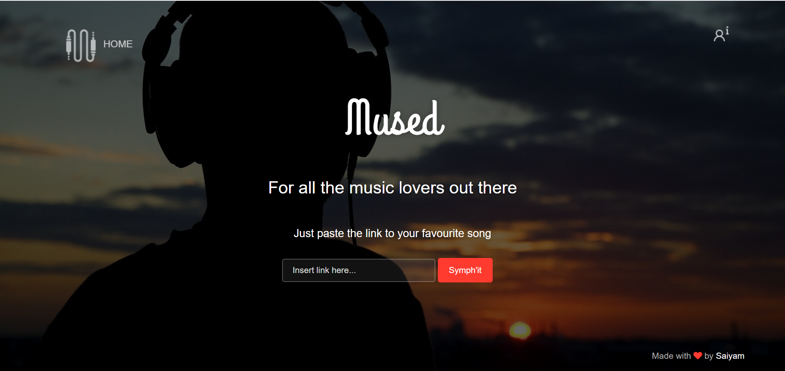
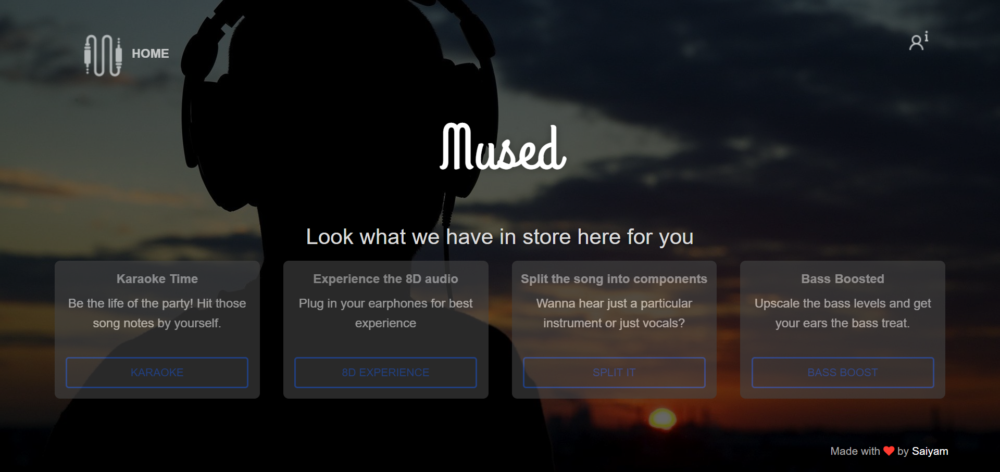
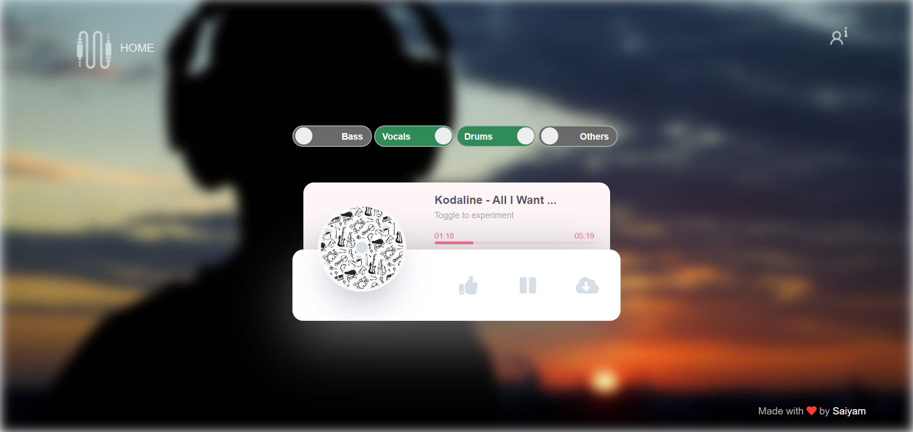
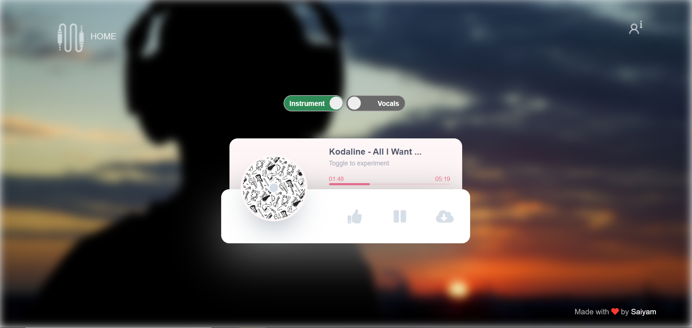
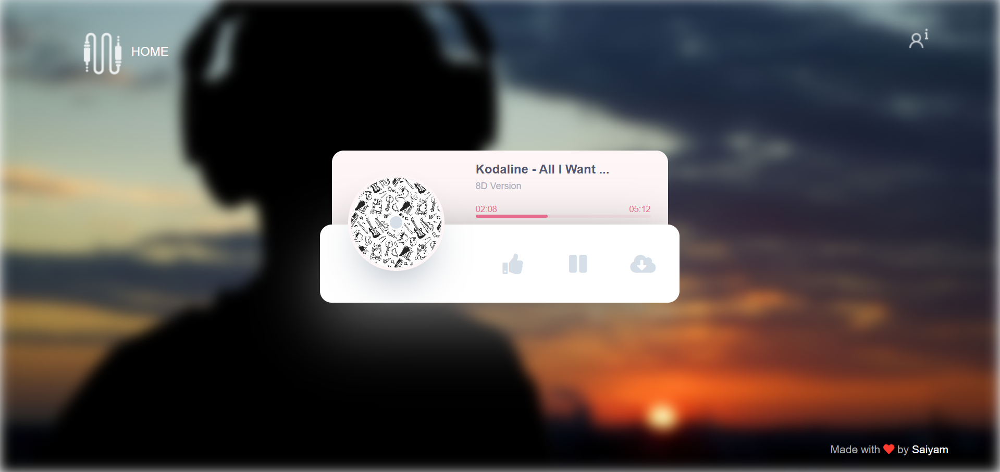

__Mused-AI-enabled-music-app__

This is a __Flask based__ webapp that lets the user do the following- 
* Make Karaoke version of the song
* Make the song ambisonic or 8D in nature
* Split all the instruments and vocal components
* Boost the bass of the song
* Download all files with just a click

The usage of the app is very easy, the user just needs to paste the _Youtube url_ link of the song as per thier choice in the following manner 

Then the mp3 version will be __downloaded in the backend__ and the user will be offered to choose between the following 4 options- 
1. Get the __Karaoke version of the song__
2. Get the __ambisonic or 8D version of the song__
3. __Split all the components__ of the song into individual layers such as instruments and vocals
4. Get the __bass boosted__ version of the song

The user then can choose any option that he/she wants let say the __split option__ was selected 

There is a __download button__ also available in the player that will __directly download__ the relevant audio files in the system of the user

Here are what other options will look like when selected

__Karaoke Option__

__8D option__

The system is so designed that once a component is selected, a user can go back to select the other option and non returning back to the previous option __no processing time would be required__, thus making it efficient to use. 

In order to save the space, the system removes all the previous files from the previous song whenever new song is loaded in the app.

In case of any issue faced, kindly report it and I shall solve that as soon as possible. 

Thanks !
